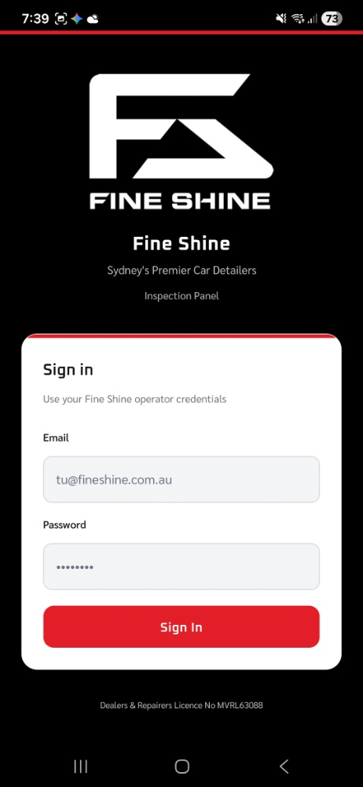
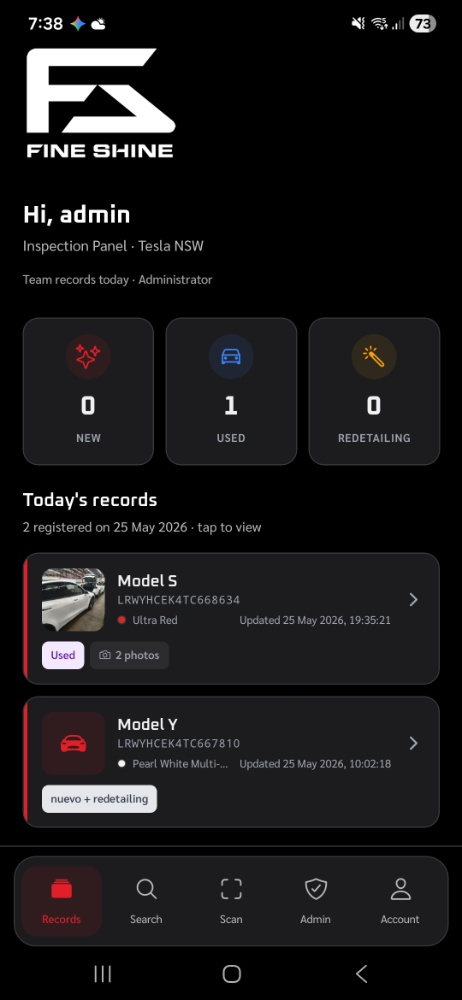
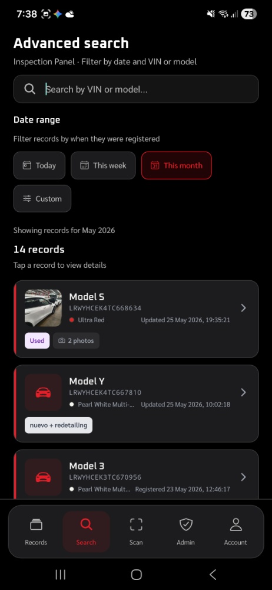
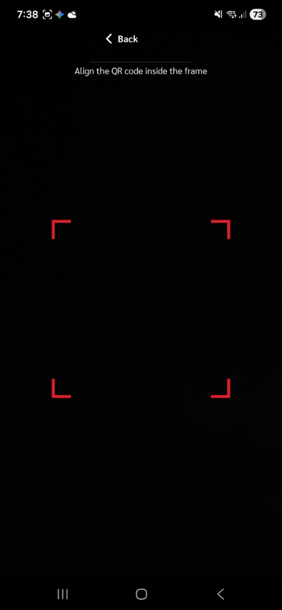
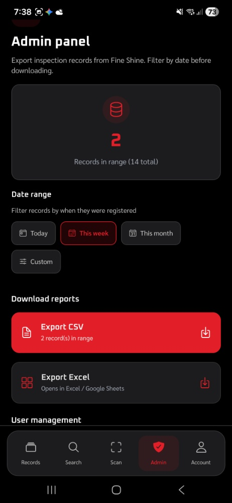
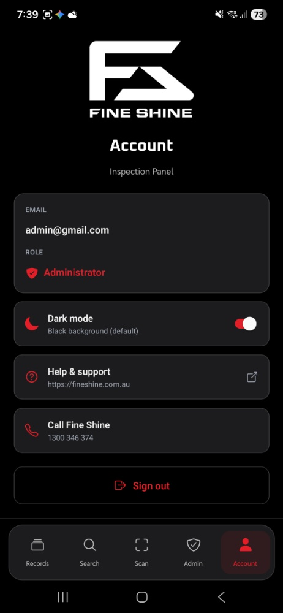

# Fine Shine - Enterprise Vehicle Inspection App 🚗✨


Fine Shine is a comprehensive B2B mobile application designed to digitize and automate the high-volume vehicle inspection, detailing, and logistics workflows. Built for efficiency, it replaces manual paperwork with a lightning-fast digital ecosystem featuring smart VIN scanning, real-time cloud syncing, and detailed reporting.

## 🌟 Key Features

* **Intelligent VIN Scanning:** Uses device camera to scan vehicle barcodes, instantly decoding the 17-character VIN to automatically identify and pre-select the exact vehicle model.
* **Real-Time Dashboard & Analytics:** Operators get a quick overview of daily targets, while the Admin Panel provides complete database exports (CSV/Excel) filtered by date ranges.
* **Photographic Evidence:** Capture and attach high-resolution photos directly to vehicle records. Images are compressed and synced securely to the cloud to protect against liability claims.
* **Role-Based Access Control (RBAC):** Secure authentication system separating standard 'Operators' (data entry focused) from 'Administrators' (full database access, user management, and exports).
* **Advanced Search & Filtering:** Powerful local search functionality to instantly locate any vehicle by its VIN, model, or specific registration date.
* **Modern UI/UX:** Sleek, responsive dark-mode interface optimized for operators working on their feet in workshop environments.

## 📸 Screenshots

| Login & Authentication | Dashboard (Admin View) | Advanced Search & Filters |
| :---: | :---: | :---: |
|  |  |  |

| QR/Barcode Scanner | Admin Export Panel | Account & Settings |
| :---: | :---: | :---: |
|  |  |  |

*(Note: To display the screenshots, ensure the images are placed in an `assets/readme/` folder inside your repository, or replace the local paths with direct image URLs).*

## 🛠️ Tech Stack

### Frontend
* **Framework:** React Native (via Expo)
* **Language:** TypeScript for strict type checking and scalable architecture.
* **Navigation:** Expo Router (File-based routing).
* **Camera API:** `expo-camera` for high-speed barcode and QR decoding.

### Backend (BaaS)
* **Database:** Firebase Firestore (NoSQL, real-time sync).
* **Storage:** Firebase Cloud Storage (Optimized image asset pipeline).
* **Authentication:** Firebase Auth (Email/Password credentials).

## 🚀 Getting Started

### Prerequisites
* Node.js (v18 or newer recommended)
* Expo CLI (`npm install -g expo-cli`)
* Expo Go app installed on your physical device (iOS/Android).

### Installation

1. **Clone the repository:**
   ```bash
   git clone [https://github.com/Deco2449584/DetailerOSProApp](https://github.com/Deco2449584/DetailerOSProApp)
   cd fine-shine-app

   Install dependencies:

Bash
npm install
Environment Setup:
Create a .env file in the root directory and add your Firebase credentials:  

Code snippet
EXPO_PUBLIC_FIREBASE_API_KEY=your_api_key
EXPO_PUBLIC_FIREBASE_AUTH_DOMAIN=your_domain
EXPO_PUBLIC_FIREBASE_PROJECT_ID=your_project_id
EXPO_PUBLIC_FIREBASE_STORAGE_BUCKET=your_bucket
EXPO_PUBLIC_FIREBASE_MESSAGING_SENDER_ID=your_sender_id
EXPO_PUBLIC_FIREBASE_APP_ID=your_app_id
Run the application:

Bash
npx expo start
Scan the generated QR code with your phone's camera (iOS) or the Expo Go app (Android) to launch the app.

🔒 License & Ownership
This project was developed as a customized commercial solution. The source code is provided here for portfolio demonstration purposes only. Unauthorized commercial distribution or reproduction is prohibited.

Developed by Daniel Esteban Caro Alvarez

